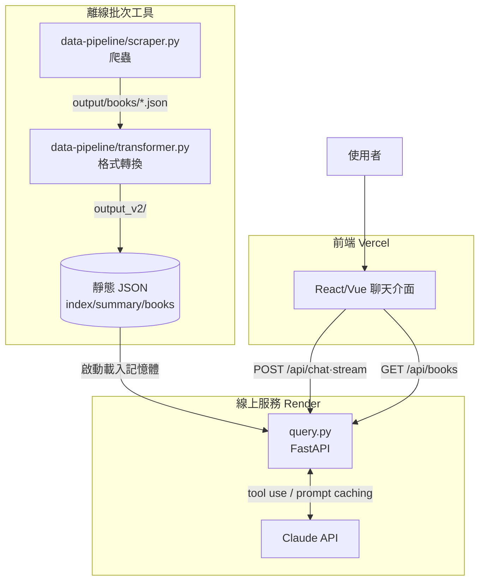

# design.md — 族語 E 樂園繪本 RAG 技術設計

> 技術設計的單一真相來源。修改者：AI 主導，重大架構決策入 `log.md`；視覺品味決定屬人類。

---

## 技術選型

| 項目 | 選擇 | 為什麼選這個 |
|---|---|---|
| 後端語言 | Python 3.11+ | 既有爬蟲與轉換工具皆 Python，延續一致；Anthropic SDK 成熟（見 log DECISION-001） |
| 後端框架 | FastAPI | 原生 async、自動產生 `/docs`、SSE streaming 支援好、型別驗證（Pydantic）內建（DECISION-002） |
| 前端框架 | React 或 Vue（待定，見 roadmap）| 內部工具，生態成熟、易找參考；最終由實作時定（DECISION-003） |
| 前端託管 | Vercel | 免費、自動 HTTPS、前端託管體驗最佳（DECISION-004） |
| 後端託管 | Render | **長駐型**服務，支援 SSE 長連線與 prompt caching 所需的進程持續性；Vercel serverless 不適合本後端（DECISION-004，關鍵理由）|
| LLM | Claude（Anthropic API）| 大 context window 可整包載入 summary、tool use 成熟、prompt caching 省成本（DECISION-005）|
| **資料儲存** | **無資料庫（靜態 JSON）** | 資料量小（95 本、summary ~10 萬 token）可整包進 LLM context；對話由前端保存，後端無狀態。vector DB 與對話持久化均屬過度工程。未來若需跨裝置歷史/帳號，再引入 Postgres（DECISION-006）|
| 成本控制 | Prompt Caching | summary 區塊設 `cache_control: ephemeral`，5 分鐘內後續請求 cached 部分僅付 10%（DECISION-005）|

---

## 系統結構

三個階段嚴格分離：**抓取 → 轉換 → 查詢**。前兩者為離線批次工具，第三者為線上服務。



**專案結構：**

```
013-族語 E 樂園繪本 RAG/
├─ backend/              線上查詢服務（Render 部署單位）
│   ├─ query.py
│   ├─ test_query.py
│   ├─ requirements.txt
│   └─ .env.example      （只放佔位字串，真實金鑰走 .env / 平台環境變數）
├─ data-pipeline/        離線批次工具（抓取 → 轉換）
│   ├─ scraper.py
│   ├─ transformer.py
│   ├─ requirements.txt
│   ├─ probe/            早期 API 偵察產物
│   ├─ output/           原始爬蟲產物（唯讀）
│   └─ output_v2/        轉換後產物，query.py 讀這裡（唯讀）
├─ frontend/             對話/瀏覽介面（Phase 3 未開始，目前佔位）
└─ 02-harness文件/        本套規範文件（spec/design/roadmap/log/...）
```

**模組職責邊界：**

- `data-pipeline/scraper.py`：只負責從 web.klokah.tw 抓資料、產生原始 `book_*.json`。對外介面為 CLI（`probe`/`list`/`book`/`all`）。
- `data-pipeline/transformer.py`：只負責格式轉換（中文去重、產生 summary/index）。輸入 `data-pipeline/output/`，輸出 `data-pipeline/output_v2/`，不碰網路。
- `backend/query.py`：只負責線上查詢。讀 `data-pipeline/output_v2/`（唯讀）、呼叫 Claude API、提供 REST + SSE。不碰網路爬取。另以子 app 形式掛載 `backend/mcp_tools.py` 至 `/mcp`。
- `backend/mcp_tools.py`：定義對外 MCP server 的純資料工具（`list_books`/`search_books`/`get_book`/`get_book_page`）。共用 `query.py` 已載入記憶體的 `INDEX_DATA` / `SUMMARY_TEXT` / `load_book_detail()`；**嚴禁**呼叫 Claude API 或任何付費外部服務；**嚴禁**寫入。
- `frontend/`：只負責 UI 與對話狀態保存，所有資料經後端 API。

---

## 對外介面

| 端點 | 方法 | 輸入 | 輸出 | 副作用 | 錯誤 |
|---|---|---|---|---|---|
| `/api/health` | GET | — | `{status, model, books_loaded, summary_chars}` | 無 | — |
| `/api/books` | GET | — | 95 筆 metadata 陣列 | 無 | — |
| `/api/books/{id}` | GET | path: id | 單本完整 JSON | 無 | 404 書不存在 |
| `/api/chat` | POST | `{messages:[...]}` | `{messages, text}` | **呼叫付費 Claude API** | 400 空 messages |
| `/api/chat/stream` | POST | `{messages:[...]}` | SSE 事件流 | **呼叫付費 Claude API** | 400 空 messages；error 事件 |
| `/mcp` | POST / GET / DELETE | MCP JSON-RPC（`initialize` / `tools/list` / `tools/call`），透過 Streamable HTTP transport | MCP 標準回應（JSON 或 SSE 串流） | **唯讀**：讀 `output_v2/` 靜態 JSON；**不**呼叫 Claude API | 標準 MCP error；超過 per-IP rate limit 回 429 |

**副作用警示**：`/api/chat` 與 `/api/chat/stream` 會呼叫付費 API；`fetch_book_detail` 工具會讀取本地 JSON（唯讀，無寫入副作用）；`/mcp` 對外完全公開、**零 LLM 成本**，僅讀靜態 JSON。

**破壞性變更判定**：以下任一即為 breaking change，須入 `log.md`（決策類型 + 不可逆風險）並通知前端：
- 移除或改名任何端點
- 改變 `messages` 的結構或 `role`/`content` 格式
- 改變 SSE 事件名稱（text/tool_use/tool_result/done/error）
- 改變 `book_*.json` 的欄位結構（影響 `fetch_book_detail` 輸出）
- 移除、改名 `/mcp` 任一對外工具或變更其 `input_schema`／回傳 schema（影響已接入的外部聊天機器人）

---

## 視覺與介面

設計語言：**像「乾淨的閱讀工具」，不像「炫技的 AI 產品」**。參考 Claude.ai 對話介面的克制感，不要滿屏漸層與動效。

設計系統重點：
- 顏色：以中性色為主（白/淺灰底、深灰字），點綴色呼應族語文化但不喧賓奪主
- 字體：須能正確顯示族語羅馬拼音的變音符號（如 ʉ、ʔ、ə）；選用涵蓋這些字元的字型
- 核心元件：對話氣泡、繪本卡片（書名/級別/語法標籤）、族語版本切換器、逐頁閱讀器

主要畫面清單（對應 spec.md 功能 ID）：
- 對話畫面（F-01、F-02、F-03、F-07）：聊天輸入 + streaming 回應 + 工具呼叫提示
- 繪本瀏覽畫面（F-04）：繪本卡片列表，可依級別/語法/族別過濾
- 繪本閱讀畫面（F-02）：逐頁圖片 + 中文 + 選定族語文字 + 音檔播放

**交給 Claude Design 的部分**：從本設計語言與主要畫面清單產生互動原型、建立設計系統、打包 handoff bundle 交 Claude Code 轉程式碼。**驗收走 Playwright MCP 自動截圖比對**，人類只做最終品味確認。

---

## 風格與慣例

主要靠工具承擔（實作時建立對應設定檔）：
- Python：`ruff`（lint + format）；設定檔 `pyproject.toml`
- 前端：`eslint` + `prettier`

文件只記工具管不到的：
- **命名慣例**：API 端點 `/api/資源（複數）`；族語相關欄位沿用既有 `ab`（族語）、`ch`（華語）對照
- **錯誤處理慣例**：API 對外只回乾淨錯誤訊息與狀態碼，不洩漏堆疊；內部錯誤一律 log
- **禁用語法**：禁用 `except: pass`（吞例外）；禁用在程式碼字面寫入任何金鑰字串

---

## 部署與環境

| 環境 | 後端 | 前端 | 差異 |
|---|---|---|---|
| local | `python query.py`（:8000）| `npm run dev`（:5173）| CORS 全開、reload 啟用 |
| prod | Render | Vercel | CORS 限定前端網域、金鑰走平台環境變數 |

**部署步驟（人類確認點以 ⚠️ 標示）：**

1. 後端：推程式碼 → Render 自動 build → ⚠️ 人類確認環境變數 `ANTHROPIC_API_KEY` 已設 → 部署
2. 前端：設定 API base URL 指向 Render 後端網址 → 推程式碼 → Vercel 自動部署
3. ⚠️ 人類確認後端 CORS 已將前端 Vercel 網域加入白名單
4. 驗證：對 prod `/api/health` 打 `curl` 確認 `books_loaded: 95`

自動化程度：build 與部署由平台自動；環境變數與 CORS 白名單為人類確認點。

**後端環境變數（Render Dashboard 設定；見根目錄 `render.yaml`）：**

| 變數 | 用途 | 備註 |
|---|---|---|
| `ANTHROPIC_API_KEY` | Claude API 金鑰 | ⚠️ 高敏感，sync:false，不入版控 |
| `CORS_ORIGINS` | 允許的前端網域（逗號分隔）| 部署前端後填 Vercel 網址；預設 `*` 僅供本機。**僅作用於 `/api/*`；`/mcp` 對外完全公開不套用此限制** |
| `CLAUDE_MODEL` | LLM 模型 | 預設 `claude-sonnet-4-6`（成本控制，DECISION-009）|
| `MCP_RATE_LIMIT` | `/mcp` 的 per-IP 上限（per minute） | 選填，預設 `60/minute`；超量回 429 |

**前端環境變數（Vercel）：** `VITE_API_BASE` = Render 後端網址（build 時注入）。

---

## 回滾預案（不可省略）

| 變更類型 | 回滾步驟 | 時間窗 | 回滾失敗的次選方案 |
|---|---|---|---|
| 後端程式碼 | Render Dashboard → 選上一個成功 deploy → Rollback | < 5 分鐘 | 本地 `git revert` 後重推 |
| 前端程式碼 | Vercel Dashboard → Deployments → 上一版 → Promote to Production | < 2 分鐘 | `git revert` 後重推 |
| 環境變數 | Render/Vercel 改回舊值 → 觸發 redeploy | < 5 分鐘 | 若金鑰外洩：立即至 Anthropic Console 撤銷舊金鑰、發新金鑰、更新環境變數 |
| 資料（JSON）| 重跑 `data-pipeline/transformer.py` 從 `data-pipeline/output/` 重新產生 `output_v2/` | < 1 分鐘 | 若 `output/` 也壞：重跑 `data-pipeline/scraper.py all` |
| 依賴 | `git revert` lockfile → 重新 install | < 10 分鐘 | 釘回上一版本號手動 install |

**金鑰外洩專屬流程（最高優先）**：發現金鑰進版控或外流 → 立即 Anthropic Console 撤銷 → 發新金鑰 → 更新 Render 環境變數 → 用 `git filter-repo` 或重建 repo 清除歷史 → 記入 `log.md`（不可逆風險）。

---

## 已知問題（技術債 + 故障處理，按嚴重度排序）

| 嚴重度 | 問題/症狀 | 緩解動作（可直接執行）| 驗證 |
|---|---|---|---|
| 高 | Render 後端冷啟動慢（免費方案閒置會休眠）| 症狀：第一次請求等 30~60 秒。緩解：升級 Render 付費方案保持常駐，或前端加 loading 提示 + 對 `/api/health` 預熱 | `curl` 連續兩次 `/api/health`，第二次應 < 1 秒 |
| 中 | prompt caching 未命中導致成本上升 | 症狀：log 中 `cache_read_input_tokens` 為 0。緩解：確認 system block 有 `cache_control: ephemeral`；確認同對話請求間隔 < 5 分鐘 | 看連續請求 usage，第二次 cache_read > 0 |
| 中 | Claude 回傳不存在的繪本 ID（幻覺）| 症狀：回應書本 ID 不在 index.json。緩解：強化 system prompt 約束；加後處理驗證回應中 ID 是否存在 | 回歸測試固定查詢，斷言回應 ID ∈ index |
| 低 | 族語變音符號顯示為亂碼/方框 | 症狀：ʉ、ʔ 等顯示異常。緩解：前端字型加 fallback 涵蓋這些 Unicode | 開繪本閱讀畫面目視（Playwright 截圖）特定族語頁 |
| 低 | 爬蟲被 web.klokah.tw 限流 | 症狀：`scraper.py` 連續 fetch fail。緩解：調高 `REQUEST_DELAY`、稍後重跑（斷點續爬）| 重跑 `data-pipeline/scraper.py all`，失敗數歸零 |
| 中 | 部署後端時漏帶資料 | 症狀：`query.py` 啟動找不到 `output_v2/`（讀的是 `../data-pipeline/output_v2`）。緩解：部署 backend 時一併打包 `data-pipeline/output_v2`，或調整 `DATA_DIR` 指向打包進來的資料路徑 | prod `/api/health` 回 `books_loaded:95` |
| 中 | LLM prose 正規化族語標點 | 症狀：對話回應把族語特殊符號（如喉塞音 `’` U+2019）改成一般 ASCII `'`，失真。**設計決定：族語逐字忠實以資料層為準**——前端閱讀畫面/逐字內容一律直接渲染 `book_*.json`，不以 LLM 對話文字為逐字來源；system prompt 另加 best-effort「引用族語勿正規化」指示。F-02 機器驗收以 tool 回傳 vs JSON 逐字比對為準 | `tests/test_chat.py::test_fetch_book_detail_text_matches_json` 通過 |
